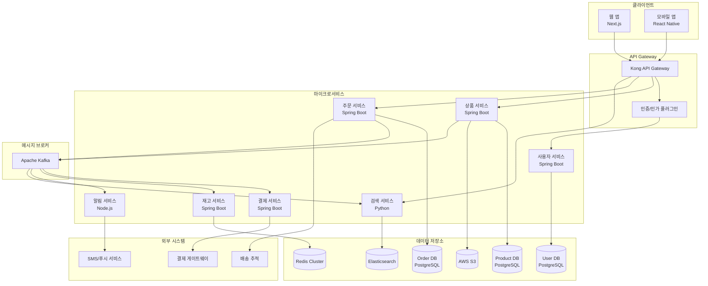
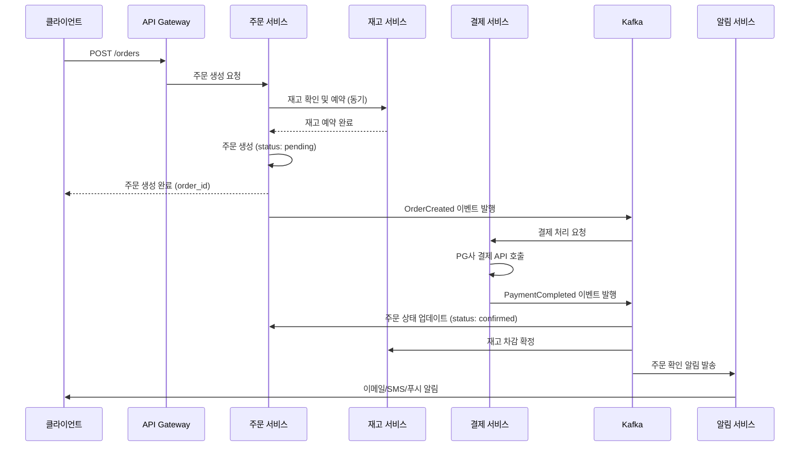
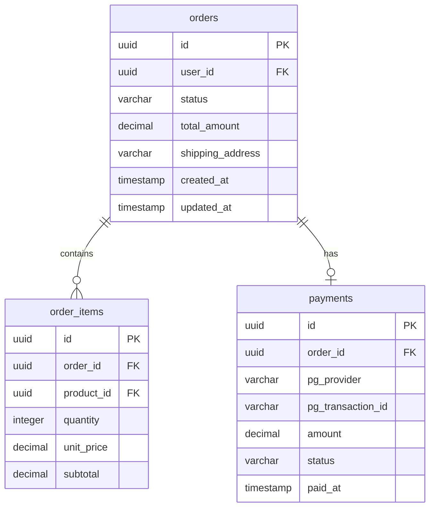

# 아키텍처 문서 예시: ShopStream 이커머스 플랫폼

> 이 문서는 `doc-technical-spec.md` 템플릿을 사용하여 생성된 완성 예시입니다.

---

# ShopStream 이커머스 플랫폼 아키텍처 문서

## 1. 개요

### 한 줄 요약

ShopStream은 마이크로서비스 기반의 이커머스 플랫폼으로, 높은 트래픽에서도 안정적인 주문 처리와 실시간 재고 관리를 제공합니다.

### 목적

이 문서는 ShopStream 플랫폼의 전체 시스템 아키텍처를 정의합니다. 개발팀이 시스템의 구조를 이해하고, 새로운 기능을 올바른 위치에 구현하며, 장애 발생 시 영향 범위를 파악하는 것을 목적으로 합니다.

### 범위

- 백엔드 마이크로서비스 아키텍처
- 데이터 저장소 설계
- 서비스 간 통신
- 인프라 및 배포 아키텍처

### 관련 시스템

| 시스템 | 관계 | 설명 |
|--------|------|------|
| PG(Payment Gateway) 연동 | 외부 | 결제 처리 (KG이니시스, 토스페이먼츠) |
| 배송 추적 시스템 | 외부 | 택배사 API 연동 (CJ대한통운, 한진택배) |
| ERP | 내부 | 재고/회계 데이터 동기화 |
| 어드민 포탈 | 내부 | 판매자/관리자 백오피스 |

## 2. 아키텍처 다이어그램

### 전체 시스템 구조



### 주문 처리 흐름



## 3. 주요 컴포넌트 설명

### 3.1 API Gateway (Kong)

- **역할**: 모든 클라이언트 요청의 단일 진입점
- **기능**: 라우팅, 인증/인가, Rate Limiting, 요청/응답 변환, 로깅
- **기술**: Kong 3.x + PostgreSQL (설정 저장)
- **설계 결정**: Nginx 기반으로 높은 처리량(초당 50,000 요청)을 지원하며, 플러그인 아키텍처로 기능 확장이 용이하기 때문에 Kong을 선택했습니다. AWS API Gateway 대비 벤더 종속성이 낮고, 자체 호스팅이 가능합니다.

### 3.2 사용자 서비스 (User Service)

- **역할**: 회원 가입, 로그인, 프로필 관리, 인증 토큰 발급
- **기술**: Spring Boot 3.2, Spring Security, JWT
- **데이터**: PostgreSQL (users, roles, sessions 테이블)
- **캐시**: Redis (세션 정보, 토큰 블랙리스트)
- **API 예시**: `POST /auth/login`, `GET /users/me`, `PATCH /users/me`

### 3.3 상품 서비스 (Product Service)

- **역할**: 상품 CRUD, 카테고리 관리, 이미지 관리
- **기술**: Spring Boot 3.2
- **데이터**: PostgreSQL (products, categories, product_images 테이블)
- **파일 저장**: AWS S3 (상품 이미지)
- **이벤트 발행**: 상품 생성/수정 시 `ProductUpdated` 이벤트를 Kafka로 발행하여 검색 인덱스 갱신

### 3.4 주문 서비스 (Order Service)

- **역할**: 주문 생성, 상태 관리, 주문 이력 조회
- **기술**: Spring Boot 3.2
- **데이터**: PostgreSQL (orders, order_items 테이블)
- **설계 결정**: 주문 생성 시 재고 확인은 동기(synchronous) 호출, 결제와 알림은 비동기(asynchronous) 이벤트 기반으로 처리합니다. 이를 통해 주문 응답 시간을 200ms 이내로 유지하면서, 결제 실패 시 재시도 및 보상 트랜잭션을 이벤트 기반으로 처리할 수 있습니다.

### 3.5 결제 서비스 (Payment Service)

- **역할**: 결제 처리, 환불, 결제 이력 관리
- **기술**: Spring Boot 3.2
- **외부 연동**: KG이니시스, 토스페이먼츠 PG API
- **설계 결정**: PG사 장애 대응을 위해 이중 PG 구조를 채택했습니다. 주 PG(KG이니시스) 응답이 5초 이내에 오지 않으면 보조 PG(토스페이먼츠)로 자동 전환합니다.

### 3.6 재고 서비스 (Inventory Service)

- **역할**: 실시간 재고 수량 관리, 재고 예약/확정/해제
- **기술**: Spring Boot 3.2
- **데이터**: Redis Cluster (실시간 재고 수량), PostgreSQL (재고 이력)
- **설계 결정**: 동시 주문 시 재고 정합성을 보장하기 위해 Redis의 WATCH/MULTI/EXEC 트랜잭션과 Lua Script를 사용합니다. Redis 장애 시 PostgreSQL로 폴백합니다.

### 3.7 알림 서비스 (Notification Service)

- **역할**: 이메일, SMS, 푸시 알림 발송
- **기술**: Node.js 20 + Express (이벤트 소비에 적합한 비동기 처리)
- **외부 연동**: AWS SES (이메일), NHN Cloud (SMS), Firebase (푸시)
- **설계 결정**: 알림은 순서 보장이 필요 없고, 처리 실패 시 재시도만 되면 되므로 Kafka Consumer Group으로 병렬 처리합니다.

### 3.8 검색 서비스 (Search Service)

- **역할**: 상품 전문 검색, 자동 완성, 필터링
- **기술**: Python 3.12 + FastAPI (데이터 처리 및 ML 라이브러리 생태계 활용)
- **데이터**: Elasticsearch 8.x
- **인덱싱**: Kafka에서 `ProductUpdated` 이벤트를 소비하여 Elasticsearch 인덱스를 비동기 갱신

## 4. 데이터 아키텍처

### 4.1 데이터베이스 분리 전략

각 마이크로서비스는 독립적인 데이터베이스를 소유합니다(Database per Service 패턴).

| 서비스 | 데이터베이스 | 용도 |
|--------|------------|------|
| User Service | PostgreSQL 16 (user-db) | 사용자, 역할, 인증 |
| Product Service | PostgreSQL 16 (product-db) | 상품, 카테고리 |
| Order Service | PostgreSQL 16 (order-db) | 주문, 주문 항목 |
| Inventory Service | Redis 7.2 Cluster + PostgreSQL 16 | 실시간 재고 + 이력 |
| Search Service | Elasticsearch 8.12 | 검색 인덱스 |

### 4.2 주문 데이터 모델 (ERD)



### 4.3 이벤트 스키마 (Kafka)

주요 이벤트 토픽과 스키마:

**토픽: `order.events`**
```json
{
  "event_type": "OrderCreated",
  "event_id": "evt_a1b2c3",
  "timestamp": "2025-03-11T10:00:00Z",
  "payload": {
    "order_id": "ord_x1y2z3",
    "user_id": "user_k8x9m2n",
    "items": [
      {
        "product_id": "prod_abc123",
        "quantity": 2,
        "unit_price": 29900
      }
    ],
    "total_amount": 59800
  }
}
```

## 5. 비기능 요구사항

### 5.1 성능

| 지표 | 목표 | 측정 방법 |
|------|------|-----------|
| API 응답 시간 (p99) | 200ms 이하 | Prometheus + Grafana |
| 주문 처리량 | 초당 500건 | 부하 테스트 (k6) |
| 검색 응답 시간 (p95) | 100ms 이하 | Elasticsearch 모니터링 |
| 시스템 가용성 | 99.95% (연간 4.38시간 다운타임) | Uptime Robot |

### 5.2 확장성

- **수평 확장**: 모든 서비스는 Stateless로 설계하여 Pod 수평 확장 가능
- **데이터베이스**: Read Replica를 통한 읽기 부하 분산
- **Kafka**: 파티션 수를 늘려 Consumer 병렬 처리 확장
- **자동 스케일링**: HPA(Horizontal Pod Autoscaler) 기반, CPU 70% 초과 시 Scale-out

### 5.3 보안

- 모든 통신은 TLS 1.3 암호화
- 서비스 간 통신은 mTLS (Istio Service Mesh)
- 민감 정보(결제 정보, 비밀번호)는 AES-256 암호화 저장
- OWASP Top 10 대응 (SQL Injection, XSS, CSRF 방지)
- PCI DSS Level 3 준수 (결제 데이터 처리)

### 5.4 모니터링

| 계층 | 도구 | 대상 |
|------|------|------|
| 메트릭 | Prometheus + Grafana | CPU, Memory, API 응답시간, 에러율 |
| 로깅 | ELK Stack | 애플리케이션 로그, 접근 로그 |
| 트레이싱 | Jaeger | 서비스 간 요청 추적 |
| 알람 | PagerDuty | 에러율 5% 초과, 응답시간 1초 초과 시 |

## 6. 인프라 및 배포

### 6.1 인프라 구성

- **클라우드**: AWS (ap-northeast-2, 서울 리전)
- **컨테이너 오케스트레이션**: Amazon EKS (Kubernetes 1.29)
- **CI/CD**: GitHub Actions + ArgoCD
- **IaC**: Terraform

### 6.2 배포 전략

- **Blue-Green 배포**: 주문/결제 등 핵심 서비스
- **Rolling Update**: 검색/알림 등 보조 서비스
- **롤백**: ArgoCD에서 이전 버전 Manifest로 즉시 롤백 (5분 이내)

### 6.3 환경 구성

| 환경 | 용도 | 규모 |
|------|------|------|
| dev | 개발/테스트 | 서비스당 Pod 1개 |
| staging | QA/통합 테스트 | 서비스당 Pod 2개 |
| production | 운영 | 서비스당 Pod 3~10개 (HPA) |

## 7. 대안 검토

### 모놀리식 vs 마이크로서비스

마이크로서비스를 선택한 이유:
- 팀이 8명 이상으로, 도메인별 독립 개발/배포가 필요
- 주문 트래픽과 검색 트래픽의 확장 패턴이 다름
- 결제 서비스의 독립적 보안 감사 요구사항

마이크로서비스의 트레이드오프:
- 분산 트랜잭션 복잡성 (Saga 패턴으로 대응)
- 운영 복잡성 증가 (Kubernetes + Service Mesh로 대응)
- 서비스 간 통신 지연 (비동기 이벤트 기반으로 최소화)

### 메시지 브로커: Kafka vs RabbitMQ

Kafka를 선택한 이유:
- 이벤트 리플레이가 필요 (주문 데이터 재처리)
- 높은 처리량 (초당 10만 메시지 이상)
- 이벤트 소싱 패턴 적용 가능성

## 8. 참고자료

- [마이크로서비스 패턴 (Chris Richardson)](https://microservices.io/patterns)
- [Kafka 설계 가이드 (Confluent)](https://docs.confluent.io/platform/current/overview.html)
- [Kong Gateway 문서](https://docs.konghq.com/)
- [ShopStream API 레퍼런스](./api-doc-example.md)
